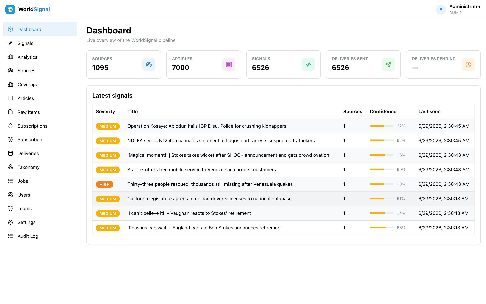
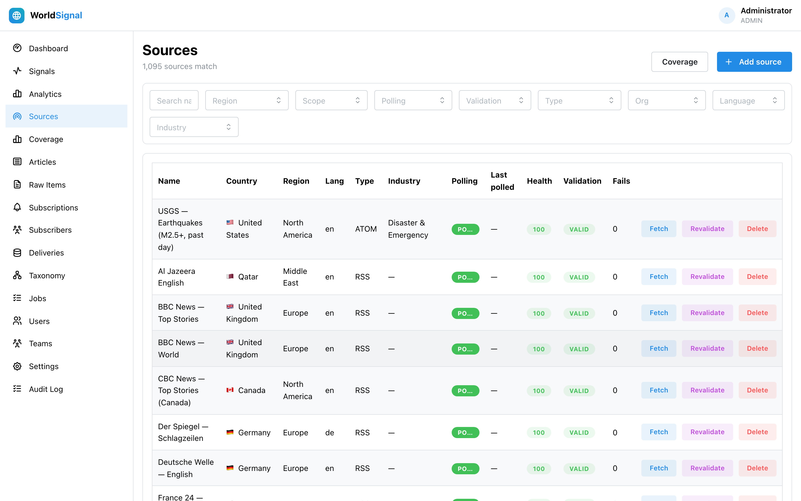
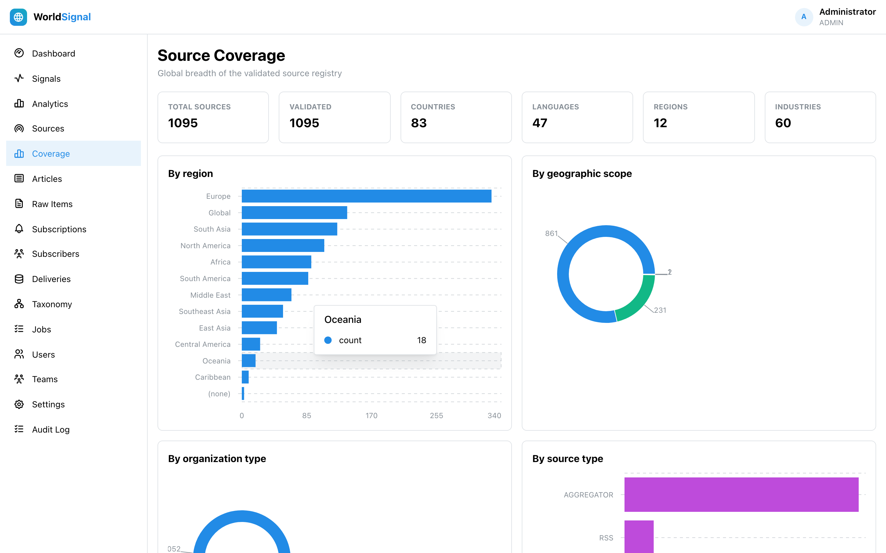
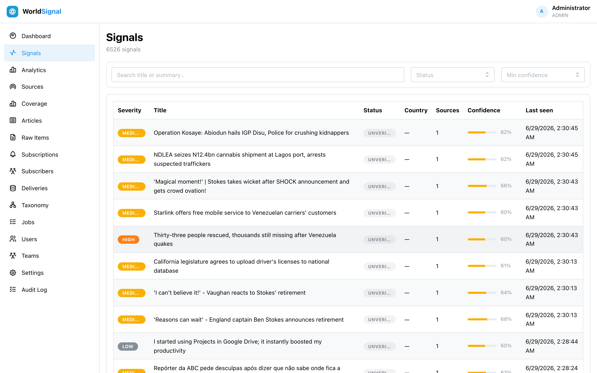

<div align="center">


### The world's public news, turned into clean, deduplicated, enriched **Signals**.

[](https://github.com/jigardafda/WorldSignal/actions/workflows/ci.yml)
[](https://github.com/jigardafda/WorldSignal/actions/workflows/codeql.yml)
[](https://securityscorecards.dev/viewer/?uri=github.com/jigardafda/WorldSignal)
[](https://goreportcard.com/report/github.com/worldsignal/backend)
[](LICENSE)
[](backend/go.mod)
[](#testing)

</div>

WorldSignal is **not** a news scraper. The durable asset is not the article — it is the
deduplicated, enriched, source-backed **Signal**. One Signal can have many source articles
behind it. It ingests 1,000+ validated global feeds, normalizes and clusters them into
canonical events, classifies them against a closed taxonomy (LLM or heuristic), and
distributes them via webhook/polling — all on **Postgres alone** (no Redis/Kafka/vector DB).

```
Sources → Ingestion → Normalization → Dedupe/Cluster → Enrichment → Distribution
```

---

## Table of contents

- [Screenshots](#screenshots)
- [Features](#features)
- [Quick start](#quick-start)
- [Configuration](#configuration)
- [Architecture](#architecture)
- [Usage examples](#usage-examples)
- [Testing](#testing)
- [Troubleshooting](#troubleshooting)
- [FAQ](#faq)
- [Documentation](#documentation)
- [Contributing](#contributing)
- [Security](#security)
- [License](#license)

## Screenshots

| Dashboard | Sources |
|---|---|
|  |  |

| Coverage | Signals |
|---|---|
|  |  |

## Features

- **Canonical Signals** — exact dedupe (canonical URL + content hash) and token-similarity clustering turn many articles into one source-backed event.
- **1,000+ validated global sources** — every feed is fetched, parsed, freshness-checked and health-scored before it's added; coverage spans countries, regions, industries and 30+ languages. See `cmd/sourcetool`.
- **Fully automated ingestion** — a scheduler enqueues due sources by crawl interval; a concurrent, fair worker pool fetches, normalizes, clusters, enriches and delivers. Repeatedly-failing sources enter an automatic **cooldown** and self-recover.
- **Multi-channel delivery** — webhooks (HMAC-signed), polling, and **email** with hourly/daily **digests**. Email uses admin-managed, encrypted **SMTP connectors** with one-click presets for Gmail, Outlook, Zoho and SendGrid. See [docs/EMAIL.md](docs/EMAIL.md).
- **Closed taxonomy classification** — the LLM is constrained to a fixed vocabulary; with no API key it falls back to a deterministic keyword classifier, so the pipeline always produces Signals.
- **LLM key management** — system key from the environment plus admin-managed keys, encrypted at rest, validated against the provider, with a live model picker.
- **Auth, RBAC & audit** — bearer sessions, bcrypt, ADMIN/EDITOR/VIEWER roles, and an audit log of security-relevant actions.
- **GraphQL + REST APIs** and a responsive **React + Mantine** admin console.
- **Postgres-only** job queue, scheduler and storage — one dependency to operate.

## Quick start

> Prerequisites: **Go 1.26+**, **Node 20+**, **Docker** (for Postgres), `psql`.

```bash
git clone https://github.com/jigardafda/WorldSignal.git
cd WorldSignal

# 1. Start Postgres (user/pass/db = worldsignal) and create the base schema
docker compose up -d postgres
make db-bootstrap                 # applies backend/schema/schema.sql

# 2. (optional) local secrets — OpenAI key etc.
cp .env.example backend/.env.local   # edit as needed; git-ignored

# 3. Run backend (API + workers + scheduler) and the web console together
./dev.sh
```

- Web console: <http://localhost:5173> · GraphQL: <http://localhost:4000/graphql> · Health: <http://localhost:4000/health>
- Default admin: `admin@worldsignal.local` / `admin12345` — **change it after first login**.

Without an `OPENAI_API_KEY`, enrichment uses a deterministic heuristic, so the pipeline still
produces Signals. Everything runs in Docker too: `docker compose up --build` (web console on
<http://localhost:8080>, API on `:4000`).

### Other ways to run

```bash
go install github.com/worldsignal/backend/cmd/server@latest        # binary
docker compose up --build                                           # full stack
make help                                                           # all dev tasks
```

## Configuration

All configuration is via environment variables (validated at startup). The most important:

| Variable | Default | Description |
|---|---|---|
| `DATABASE_URL` | — (required) | Postgres connection string. |
| `ROLE` | `all` | `all`, `api`, or `worker` (scale API and workers independently). |
| `OPENAI_API_KEY` | _(empty)_ | Enables LLM enrichment; empty ⇒ heuristic fallback. |
| `WEBHOOK_SIGNING_SECRET` | `change-me-in-prod` | Signs webhooks **and** encrypts stored LLM keys — set a strong value. |
| `SOURCE_FAILURE_THRESHOLD` / `SOURCE_COOLDOWN_MINUTES` | `5` / `180` | Source cooldown policy. |

Full list and details: [`.env.example`](.env.example) and [docs/CONFIGURATION.md](docs/CONFIGURATION.md).

## Architecture

```
            ┌────────────┐  GraphQL / REST   ┌──────────────────┐
 Browser ─► │ React SPA  │ ────────────────► │  Go HTTP server  │
 (admin)    │ (Mantine)  │                   │  internal/httpapi│
            └────────────┘                   └────────┬─────────┘
                                ┌─────────────────────┼───────────────┐
                          ┌─────▼─────┐        ┌───────▼──────┐ ┌──────▼──────┐
                          │ Postgres  │◄───────│  Job queue   │ │ LLM gateway │
                          │  (pgx)    │        │  + scheduler │ │  (OpenAI)   │
                          └───────────┘        └──────┬───────┘ └─────────────┘
                                          fetch → parse → enrich → cluster → deliver
```

A single binary runs as `ROLE=all|api|worker`. Deep dive: [docs/ARCHITECTURE.md](docs/ARCHITECTURE.md).

## Usage examples

```bash
# Discover, validate and seed the global source catalog (only live feeds are kept)
cd backend && go run ./cmd/sourcetool catalog          # coverage stats (no network)
go run ./cmd/sourcetool seed -only all                 # validate + seed into the DB
```

```graphql
# GraphQL: latest high-severity signals
query { signals(filter: { severity: "HIGH" }, limit: 10) { title country severity sources { publisher url } } }
```

See [docs/API.md](docs/API.md) for the full GraphQL/REST surface.

## Testing

```bash
# Backend (needs a Postgres test DB; DB tests serialize). Coverage gate ≥95%.
cd backend && go test ./... -p 1
# Frontend
cd frontend && npm test && npm run lint && npm run typecheck
npm run test:e2e          # Playwright end-to-end vs the Go backend
```

Both suites are gated at **≥95% coverage** in CI, alongside race detection, golangci-lint,
`go vet`, `gofmt`, govulncheck, CodeQL, OpenSSF Scorecard and cross-platform builds.

## Troubleshooting

- **`DATABASE_URL is required` / connection refused** — start Postgres (`docker compose up -d postgres`) and run `make db-bootstrap`.
- **No articles being ingested** — ensure a `ROLE=all`/`worker` instance is running; the scheduler logs `scheduler tick: due=N enqueued=N`. A source stuck failing enters cooldown (filter Sources → *In cooldown*).
- **LLM disabled** — set `OPENAI_API_KEY` or add a key under **Settings**; otherwise heuristic enrichment is used.
- **Tests can't connect** — set `TEST_DATABASE_URL` to your Postgres test DB.

More: [docs/RUNBOOK.md](docs/RUNBOOK.md).

## FAQ

- **Is this a scraper?** No — the product is the deduplicated, enriched **Signal**, not the article.
- **Do I need an OpenAI key?** No. Without one, a deterministic heuristic classifier is used.
- **Why Postgres only?** Operational simplicity — the queue, scheduler and storage all live in one database.
- **Can I use my own LLM provider keys?** Yes — admins add keys in **Settings**; they're encrypted at rest and override the env key.

## Documentation

[Architecture](docs/ARCHITECTURE.md) · [API](docs/API.md) · [Database](docs/DATABASE.md) ·
[Configuration](docs/CONFIGURATION.md) · [Email & digests](docs/EMAIL.md) · [Deployment](docs/DEPLOYMENT.md) ·
[Runbook](docs/RUNBOOK.md) · [Roadmap](ROADMAP.md) · [Changelog](CHANGELOG.md)

## Contributing

Contributions are welcome! A new contributor can clone, build and run in minutes — see
[CONTRIBUTING.md](CONTRIBUTING.md), the [Code of Conduct](CODE_OF_CONDUCT.md), and
[GOVERNANCE.md](GOVERNANCE.md). Good first issues are labeled `good first issue`.

## Security

Please report vulnerabilities privately — see [SECURITY.md](SECURITY.md). Never commit secrets;
`.env.local` is git-ignored and the build is configured to keep credentials out of the repo.

## License

[MIT](LICENSE) © 2026 The WorldSignal Authors.
